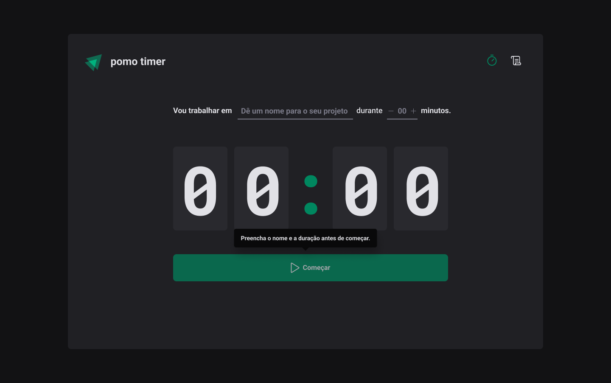

## ⏰ Pomo Timer | Visualização

  
  

 

  

## 💻 Projeto

O Pomo Timer é um app que utiliza a técnica de Pomodoro para aumentar a produtividade, já que divide o fluxo de trabalho em ciclos de concentração intercalados com pausas curtas para descansar o cérebro. 

## ✨ Tecnologias

Esse projeto foi desenvolvido com as seguintes tecnologias:

- [React](https://reactjs.org)
- [TypeScript](https://www.typescriptlang.org/)
- [Styled Components](https://www.npmjs.com/package/styled-components)
- [React Router Dom](https://github.com/remix-run/react-router/blob/main/docs/getting-started/tutorial.md)
- [React Hook Form](https://react-hook-form.com/)
- [Zod](https://zod.dev/)
- [Context API]()
- [UseReducer]()
- [Immer]()

## 📖 Conhecimento
Com o Pomo Timer, aprendi a utilizar:
- `styled-components` para que a estilização e criação de temas;
- `ESLint` para definir padrões de escrita do código;
- `React Router Dom` para definit as configurações das rotas;
- `phosphor icons` para importar os ícones;
- `React Hook Form` para melhorar o desempenho do formulário;
- `zod` para validar o formulário;

## Utilização do projeto

### 💾 Baixar o projeto
Faça o clone do repositório para ter uma versão do projeto em sua máquina: 
`$ git clone https://github.com/mmanaclara/pomo-timer.git`

### 🧰 Instalar dependências
`$ npm install ou yarn`  

### 🚀 Iniciar o projeto
`$ npm run dev ou yarn dev`
 
Agora você pode acessar [`localhost:3000`](http://localhost:3000) do seu navegador.

## 📝 Licença
Este projeto está licenciado nos termos da licença [MIT](https://github.com/mmanaclara/pomo-timer/blob/main/LICENSE). 
